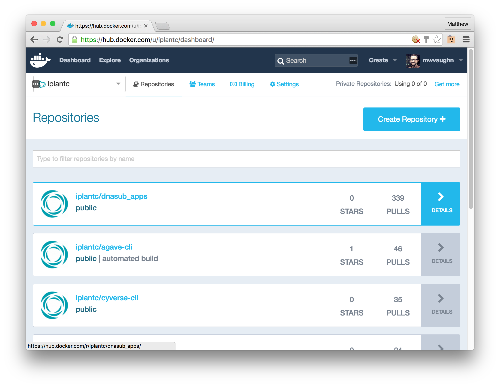
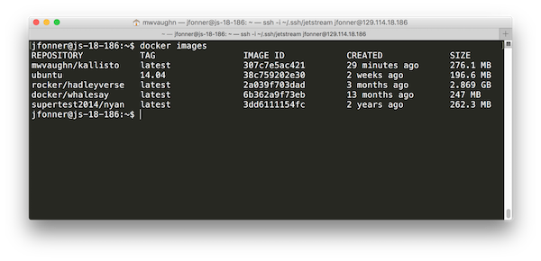

# Containers

## Introduction

It is common to build new analysis methods utilizing multiple programs, libraries, and modules, e.g., SAMtools or R with Bioconductor. Often you need very specific versions of the operating system and underlying programs, such as Ubuntu version 14.04, Bioconductor version 3.2, R version 3.2.2, and SAMtools 1.3, to correctly achieve desired results.

This delicate balance of dependencies is often called the “Software Dependency Hell”. It adversely impacts reproducibility of analyses and makes it very challenging to share your programs, pipelines, and analysis methods with collaborators and users who do not have access to identical systems, i.e., the same versions of all underlying software and operating system.

These issues have made it challenging for users to integrate new applications and analysis methods in the Cyverse Discovery Environment (DE), as the underlying execution platform could only support a limited number of versions of the same software, e.g., if your program expects to find the BWA program version 0.7.12 in /usr/local/bin/bwa, and another program expects 0.7.13, it was impossible for these to coexist without modifications to your code. With advances in container technology, these issues are now very easy to resolve, and support highly customized execution environments for every analysis. CyVerse is making use of Docker, one of the popular containerization platforms.

Additionally, public repositories of docker containers, such as [dockerhub.com](dockerhub.com) and [quay.io](quay.io), make it simple to share containers and use containers built by others.



## Containers vs. virtual machines (VMs)

The Docker website itself provides a concise comparison of containers and virtual machines [here](https://www.docker.com/what-docker#/VM).  The major commercial driver for developing and adopting the use of containers is web hosting.  Before containers, the best way to host a website in the cloud was to package everything into a virtual machine.  That way, if the host needed maintenance or a hardware update, the VM could be moved to a different server, web traffic could be sent to the new server, and there would ideally be no downtime.  Unfortunately, VMs are typically quite large in size, have a performance penalty because of the virtualization layer, and take several minutes (usually) to boot or reboot the VM image.

Containers provide an equally convenient way of packaging software along with all of its dependencies.  The way they are built up means they can do so with a much smaller footprint on the filesystem, with a much faster boot time (usually a few seconds), and because of the way containers create a unified filesystem, they sometimes end up having better performance than using the host operating system directly.

## Getting started with Docker

For future reference, Docker provides downloadable tools for most operating systems.  This means that you can build and develop apps and workflows on your own computer, run test jobs locally on your computer, and once everything is working, use that same docker app on any system that has the Docker Engine installed.

### Setting up

You can [install Docker on Linux, Mac or even Windows systems](https://docs.docker.com/engine/installation/) and we encourage you to do so. In the interests of time, however, we've created a Docker host on [Jetstream](http://use.jetstream-cloud.org), a cloud computing system provided via XSEDE. The system has several test accounts that are all configured to use Docker from a command line interface, and it is available via a web-based SSH terminal

* Go to [http://js-18-186.jetstream-cloud.org/](http://js-18-186.jetstream-cloud.org/)
* Log in with a test account. The usernames are: `demo1-32` and the corresponding passwords are `1-32demo`
* Please don't replicate this setup - it's terribly insecure but we wanted to make things easy for the AKES session.

You will see a screen resembling this one if you are successful in connecting to the host:


### Running an existing container

Before we make our own app, let's try running an existing app. Type this command into the terminal on the Docker host:

```
docker run hello-world
```

Docker has lots of commands, the "run" command accepts an image name and tries to start up a container based on that image.  In this case, we said that the image was called "hello-world", and we did not give a specific version. If successful, your output will look like this:

```
Unable to find image 'hello-world:latest' locally
latest: Pulling from library/hello-world
c04b14da8d14: Already exists
Digest: sha256:0256e8a36e2070f7bf2d0b0763dbabdd67798512411de4cdcf9431a1feb60fd9
Status: Downloaded newer image for hello-world:latest

Hello from Docker!
This message shows that your installation appears to be working correctly.

To generate this message, Docker took the following steps:
 1. The Docker client contacted the Docker daemon.
 2. The Docker daemon pulled the "hello-world" image from the Docker Hub.
 3. The Docker daemon created a new container from that image which runs the
    executable that produces the output you are currently reading.
 4. The Docker daemon streamed that output to the Docker client, which sent it
    to your terminal.

To try something more ambitious, you can run an Ubuntu container with:
 $ docker run -it ubuntu bash

Share images, automate workflows, and more with a free Docker Hub account:
 https://hub.docker.com

For more examples and ideas, visit:
 https://docs.docker.com/engine/userguide/
```

If we look closely at the output, we see that Docker looked on the computer where it was running first to see if it had a downloaded copy of that container.  When it didn't find a container named hello-world, it went to search a hosting service (by default dockerhub) to see if there was a matching image.  Notice that since we didn't give a version, it just looked for the "latest" version, and since we didn't specify the author of the container, it looked in its "library" of official containers.  After it downloaded the container, it ran the container, and the container printed out some information for us. Since we're in a multi-user environment, someone else may have already pulled the `hello-world` image, but that's OK. 

This is a very simple toy example, but let's look at what went into creating this Docker image.  This image was actually generated from a GitHub repository, which is publically visible here: [https://github.com/docker-library/hello-world/tree/master/hello-world](https://github.com/docker-library/hello-world/tree/master/hello-world)

In the Github repository, there are three files:

* hello - this is a precompiled C program that is responsible for outputting the message we saw as standard output
* greeting.txt - a text file that contains the message "Hello from Docker!"
* Dockerfile - this file contains the recipe for creating the docker image we just ran

If we look inside the Dockerfile, here are the contents:

```
FROM scratch
COPY hello /
CMD ["/hello"]
```

#### [FROM](https://docs.docker.com/engine/reference/builder/#/from)

FROM is a Docker command that sets the "base image" that the rest of the recipe will build from.  "scratch" is a very minimal base image that is perfect for this simple app.  Practically speaking, apps will generally be built using something like "ubuntu" or "debian" as a fully featured base image, or "alpine" or "busybox" for a resulting image that has a small file size.

#### [COPY](https://docs.docker.com/engine/reference/builder/#/copy)

When Docker builds an image, it sets its current directory to wherever you run the docker command, which by default (and convention) is generally the same directory as the Dockerfile.  The COPY command takes a set of files and packages them up into a destination within the image.  In this case, the command is copying the "hello" command.  Notice that "greeting.txt" is never copied into the image.  Maybe it was used during compile time, but as far as we are concerned, it's just an informational file that lives only in the GitHub repository.

#### [CMD](https://docs.docker.com/engine/reference/builder/#/cmd)

The CMD is the default command that runs when we run a Docker container.  We could override the default command, as we'll show later, but this example is pretty much a one trick pony.

### A little more sophisticated example: NCBI BLAST+

Here is the Dockerfile for a very commonly accessed image, our old friend NCBI BLAST+. This file is accessible at a public [Github repository](https://github.com/simonalpha/ncbi-blast-docker) or via the image's [Docker Hub page](https://hub.docker.com/r/simonalpha/ncbi-blast-docker/~/dockerfile/).

```
#
# NCBI BLAST+ 2.2.30+ Dockerfile
#
# https://github.com/simonalpha/ncbi-blast-docker
# https://github.com/simonalpha/ncbi-blast-docker/tree/master/ncbi-blast-2.2.30+
#
# Provide`s NCBI BLAST+ binaries, mainly for use with Galaxy Project dockerised runners

FROM debian:wheezy

MAINTAINER Simon Belluzzo <simon@belluzzo.id.au>

RUN apt-get update && apt-get install -y --no-install-recommends \
		curl \
		python-minimal=2.7.3-4+deb7u1 \
	&& rm -rf /var/lib/apt/lists/*

# Download & install BLAST
RUN mkdir /opt/blast \
      && curl ftp://ftp.ncbi.nlm.nih.gov/blast/executables/blast+/2.2.30/ncbi-blast-2.2.30+-x64-linux.tar.gz \
      | tar -zxC /opt/blast --strip-components=1

ENV PATH /opt/blast/bin:$PATH

# set default behaviour
WORKDIR /blast
CMD ["bash"]
```

:star2: Key idea: Step-by-step instructions for installing and configuring BLAST are described in a simple, readable text file that can be shared and maintained under source control. This helps with reproducibility (a lot!).

### Building a Docker container

If you have Dockerfile that you like, feel free to paste it into a file and use it in the next step. Otherwise, you may import one of these Dockerfiles and use it instead. 

* [Kallisto](https://raw.githubusercontent.com/cyverseuk/kallisto/master/Dockerfile)
* [FastQC](https://raw.githubusercontent.com/conradstoerker/fastqc/master/Dockerfile)
* [BWA](https://raw.githubusercontent.com/lh3/bwa-docker/master/Dockerfile)
* [Spades](https://raw.githubusercontent.com/nucleotides/docker-spades/master/Dockerfile)

Hint: To import a URL into a local Dockerfile use `curl -skL -O $URL`

#### Let's build!

As we saw before, part of Docker's usefulness is that you can tag and version containers so that people, not just computers, can make effective use of them. Before we build our own container, we need to choose a tag name for it. It's common to just use the name of the software you are building. For example, if you're building a `Moof` container, a good tag name is `moof`. If you have a Dockerhub (or other public registry) account, you can add your username to the front of the tag. My Dockerhub account is `mwvaughn` so I could use the tag `mwvaughn/moof` when I build my [Moof](https://en.wikipedia.org/wiki/Dogcow) container.

:star2: Today, please use your *local username on the Docker host*. So, if you are are logged in as user `demo16` and building `bwa`, use the tag `demo16/bwa` like so `docker build -t demo16/bwa  .`

Go ahead and import your Dockerfile and build an image. Likely, a lot of information will fly by - try to match it all up with what the Dockerfile says to do! 

When it looks like everything has completed, confirm that your image got built by typing `docker images`. You should see something like this, except there will also be an image with *your tag* associated with it.



### Run a container

Containers are executable. That's the other part of their magic. You can do this with the following command:

```docker run [docker-options] TAG [command] [command options]```

For instance, try this one out:

```docker run docker/whalesay cowsay "Hello, BOSC!"```


### Building your own container

In the remaining time (or on your own), try Dockerizing an application yourself. Pretty soon, you'll be unstoppable (or insufferable)!

