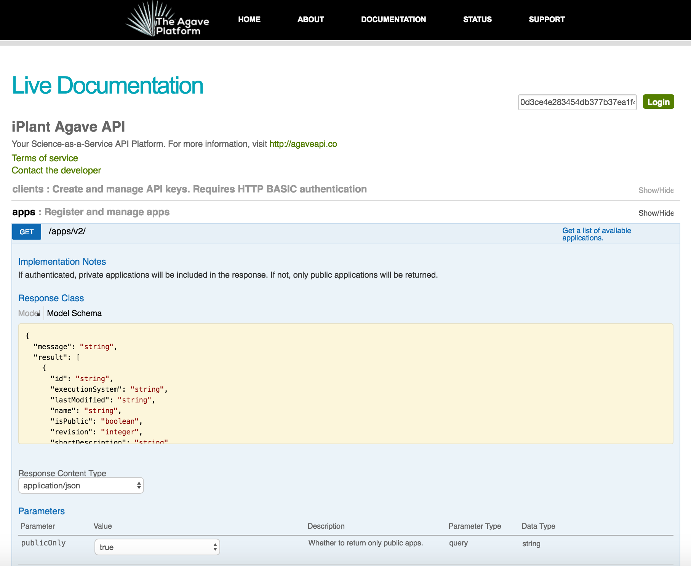
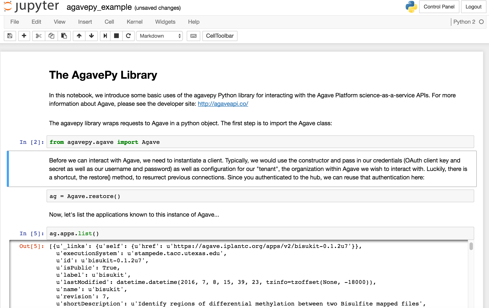
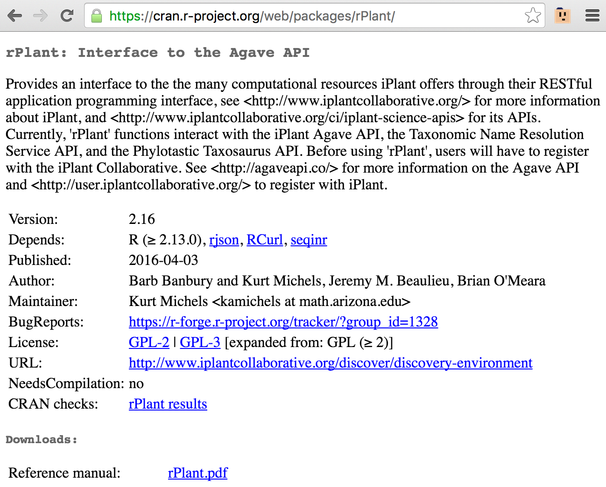
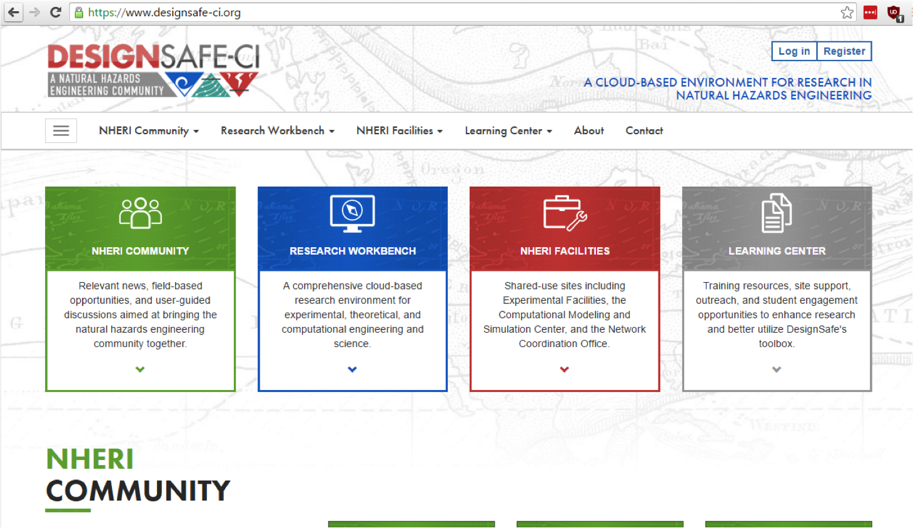
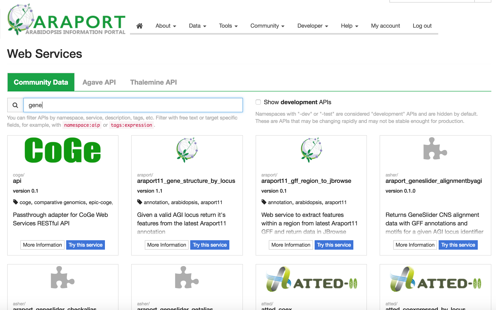
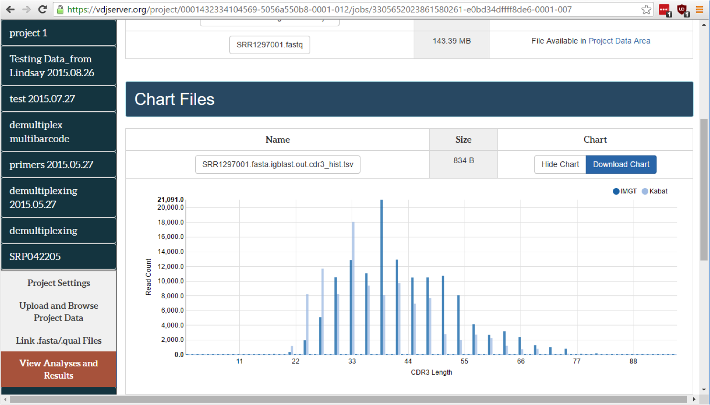
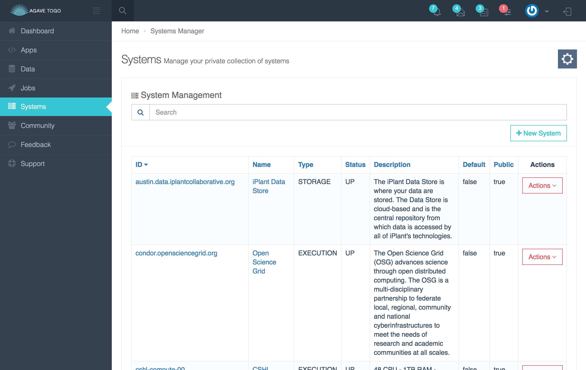

# User Interfaces

The Cyverse Science APIs provide a set of building blocks for accessing and extending data and computing resources into a unified cyberinfrastructure. We can utilize this interface through the command line and within scripts, which we have focused on thus far, and an increasing number of groups are building web apps that provide bespoke, accessible tools for streamlining data science.  In this session, we will examine additional access modes for the Science APIs, including use of interactive web portals. We will discuss use cases for building these applications and tools that faciltate developing them. 

:star2: Key idea: Users at all levels of technical experience can use an instance of the Agave API using interfaces that are consistent with their skill set. Applications, data, results are comparable and sharable, no matter which interface was used. 

# Web Services

Below the command line interface we've been using in our exercises is a set of hypermedia-compliant REST-like web service API documented using version 2.0 of the OpenAPI specification. 

# Language Libraries

The Agave APIs can be used via Python, Java, [Smalltalk](http://www.smalltalkhub.com/#!/~kulisics/Agave), Javascript, and R support libraries. 

[AgavePy](https://pypi.python.org/pypi/agavepy) can be embedded in a JupyterHub Python2/3 notebook. 

[rPlant](https://cran.r-project.org/web/packages/rPlant/) is a phylogenetics-specific packaging of Agave for Rstats 2.16+

# Cyverse Discovery Environment

[https://de.iplantcollaborative.org/de](https://de.iplantcollaborative.org/de)

DiscoveryEnvironment is a Clojure application that uses HTCondor and Agave together.

# DesignSafe

[https://www.designsafe-ci.org/](https://www.designsafe-ci.org/)

DesignSafe is a Django application that uses AgavePy. 

# Araport

[https://www.araport.org/](https://www.araport.org/)

Araport features a custom service called 'ADAMA' that provides self-service Data API publishing.

# VDJ Server

[https://vdjserver.org/](https://vdjserver.org/)

VDJServer makes extensive use of Agave's built-in document store to implement its UI.

# Agave ToGo 

[http://togo.agaveapi.co/](https://togo.agaveapi.co/)

AgaveToGo is a template for building your own web applications based on Agave. 